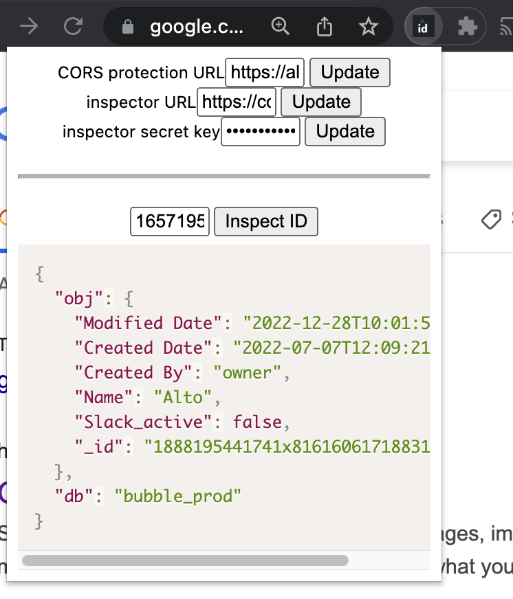

# Inspect ID
Chrome extension to find what's behind an ID

## Why
When your are developping a software @Alto, you may sometimes see an `id` in logs. You probably wonder "probably a User id" but not sure. No one can tell by reading a uuid like `0x9590b5fc46a499ad1f6k72d39b5334b1b4987fb3` what kind of data it is. And from what database it is (prod, dev, staging...)

## Solution
This extension connects to Alto bubble database using an n8n workflow. It will then fetch most tables (not all of them, be aware) and search for the `id` and retrive the first one it finds. 

### Limit 
- If you have tables duplicating ids, only the first one will be thrown. So if your staging and dev databases are strict replicas, you will only browse one of them.
- No postgres yet. Later it will also integrate Alto postgres database.

# Install
- Downlod the zip file, or clone the repo
- Open [Chrome Extension manager](chrome://extensions/), and click to activate the "Developer mode" on top-rigth of the chrome tab
- Click "Load unpacked" and select this folder, or your unzipped folder
- Activate your extension

# Use
- Fill the credentials (ask the CTO)
- Write the ID you want to inspect

# Credits
2023 @guillim
